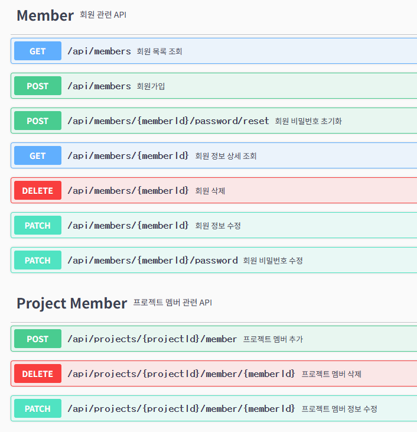
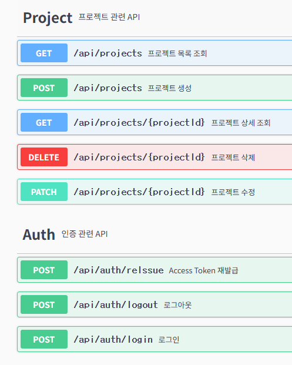
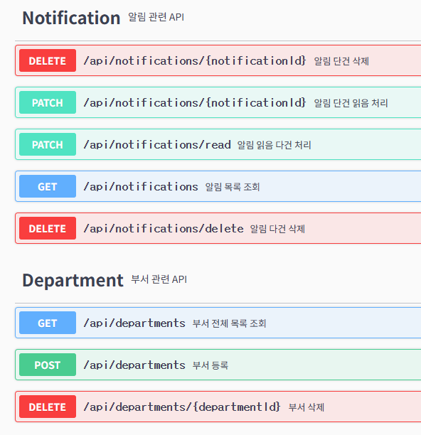
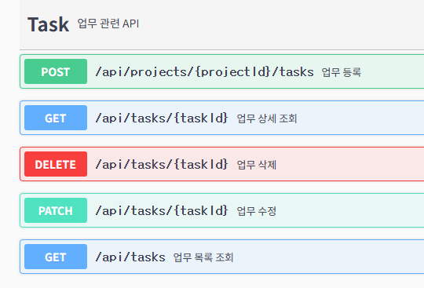
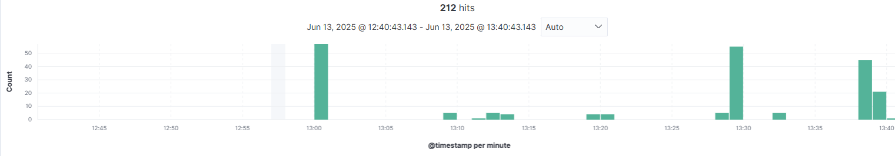
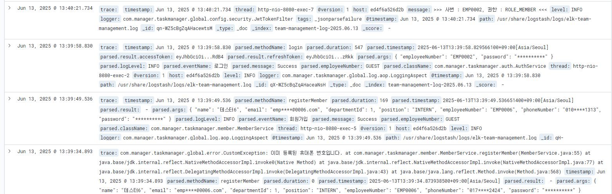
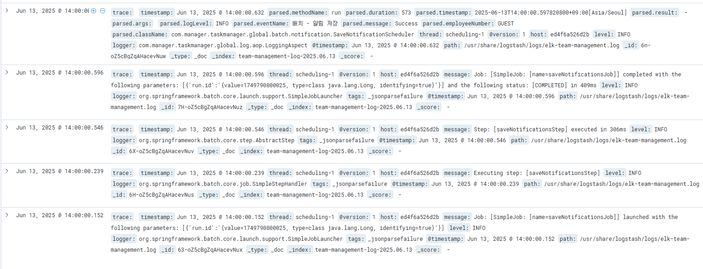

# 팀 프로젝트 및 업무 관리 시스템

### 기술 스택
- **Language**: Java 17
- **Framework**: Spring Boot
- **Batch Framework**: Spring Batch
- **Database**: MySQL
- **ORM**: JPA + QueryDSL
- **Authentication**: Spring Security + JWT
- **Documentation**: Swagger
- **Logging**: AOP + ELK Stack
- **Testing**: JUnit 5, Testcontainers
- **Build Tool**: Gradle

---

### 주요 기능
- **회원(Member)** - 생성, 조회, 수정, 삭제
- **프로젝트(Project)** - 생성, 조회, 수정, 삭제
- **프로젝트 회원(ProjectMember)** - 생성, 수정, 삭제
- **업무(Task)** - 생성, 조회, 수정, 삭제
- **알림** - 조회, 읽음 처리, 삭제
- **배치 작업** - 취소 상태인 오래된 업무 및 확인된 오래된 알림 삭제, 당일 미완료된 업무 알림 생성
- **로그 모니터링** - AOP + ELK를 활용한 로그 수집 및 모니터링

---

### API 문서(Swagger UI)
<table>
  <tr>
    <td></td>
    <td></td>
  </tr>
  <tr>
    <td></td>
    <td></td>
  </tr>
</table>

---

### LOG Monitoring (Kibana)

회원가입 실패(중복 휴대폰 번호) → 회원가입 성공 → 로그인 (비밀번호 및 토큰 마스킹 처리)

---

### BATCH JOB (Kibana Log)

매일 오후 2시 배치 작업 로그 화면